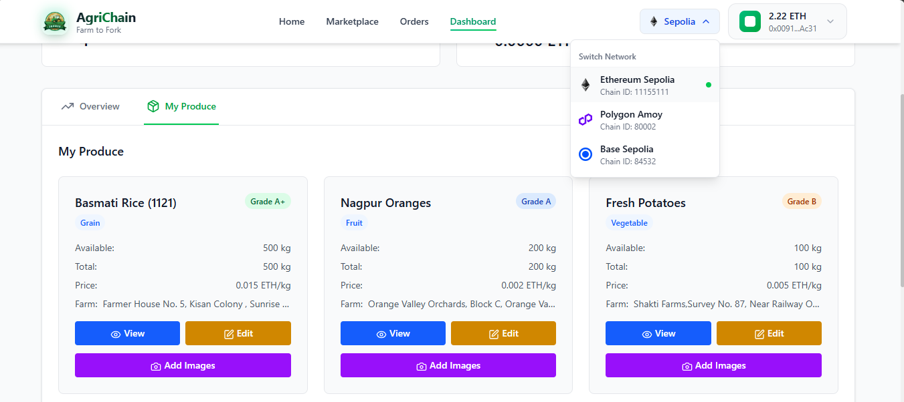
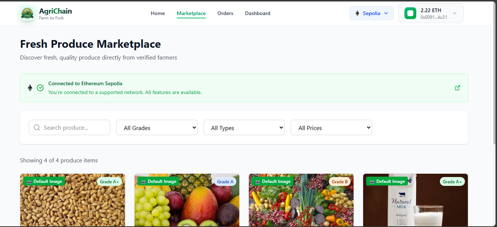
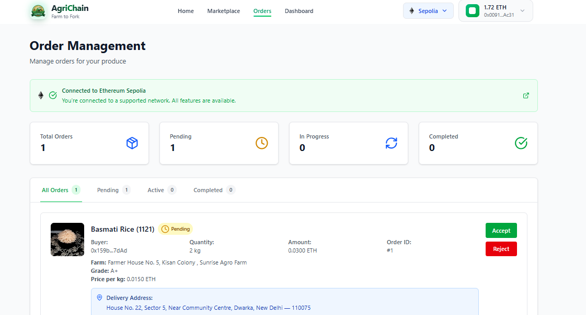
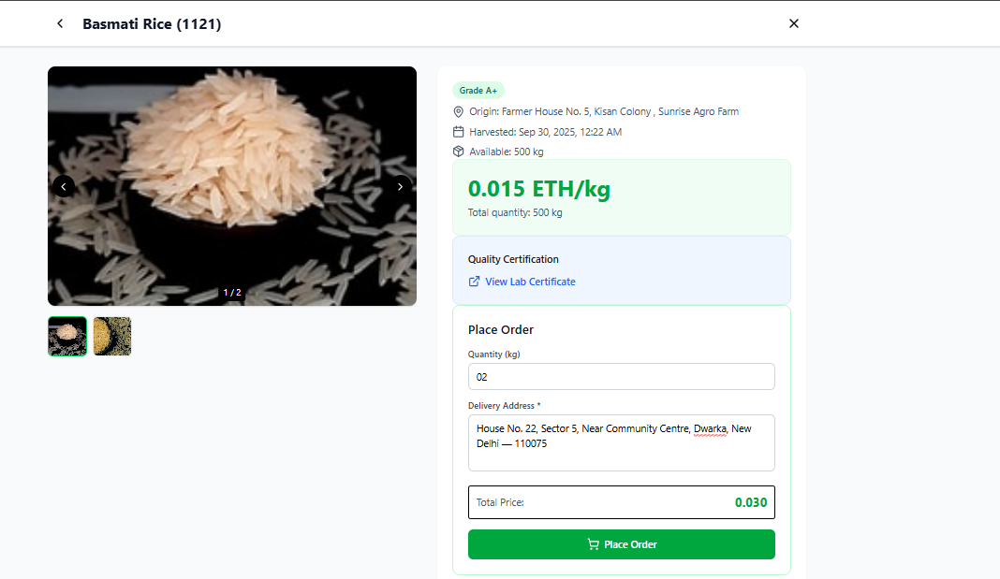
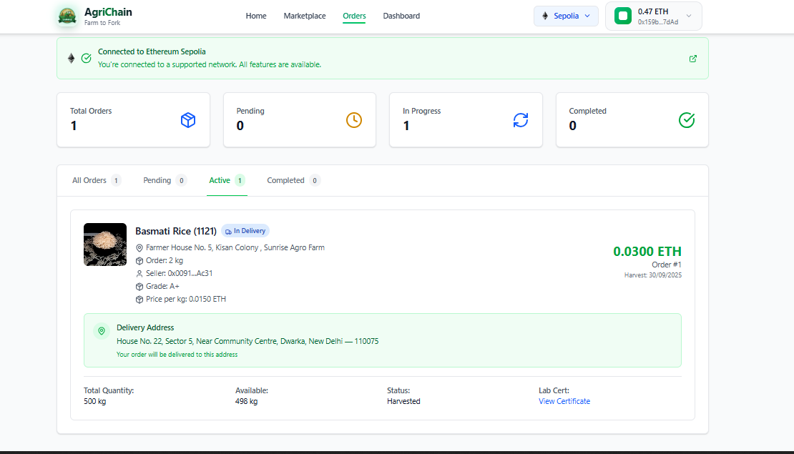
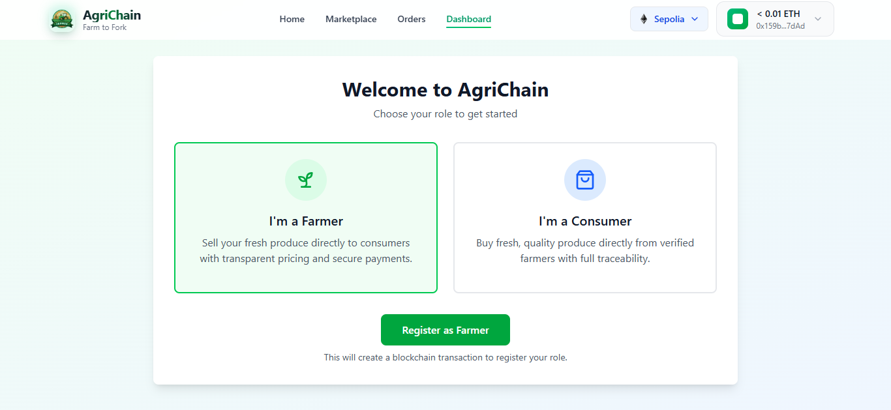

# 🌾 AgriChain - Blockchain Agricultural Supply Chain Platform

> **Revolutionizing Agriculture Through Blockchain Technology**

AgriChain is a comprehensive, blockchain-based agricultural supply chain platform that creates direct connections between farmers and consumers through transparent, secure, and traceable transactions. Built with cutting-edge Web3 technologies, React 19, and modern development practices.

[](https://opensource.org/licenses/MIT)
[](https://reactjs.org/)
[](https://vitejs.dev/)
[](https://ethereum.org/)

## 📸 Application Screenshots

### 🏠 **Landing Page & Hero Section**

*Modern landing page with compelling hero section showcasing blockchain agriculture*

### 👨‍🌾 **Farmer Dashboard**

*Comprehensive farmer dashboard with real-time statistics, produce management, and analytics*

### 🛒 **Marketplace Experience**

*Browse fresh produce with advanced filtering, search, and quality verification*


*Detailed marketplace interface showing produce cards with pricing and farm information*

### 📋 **Order Management**

*Farmer order management interface with accept/reject functionality and delivery tracking*


*Consumer order placement interface with quantity selection and delivery details*


*Real-time order tracking system showing delivery status and progress updates*

### 🔐 **User Registration & Authentication**

*Role-based registration system for farmers and consumers with blockchain integration*

### 💰 **Secure Payment System**

*Blockchain-based escrow payment system ensuring secure transactions between parties*

> 🎯 **All screenshots showcase real application functionality with actual blockchain integration - no mock data!**

## 🎯 Project Status: **Production Ready** ✅

### 🆕 Latest Updates & Achievements

#### ✅ **Complete Feature Implementation**
- **🔄 Real-time Order Management**: Full order lifecycle with blockchain integration
- **📊 Dynamic Dashboards**: Live statistics from blockchain data (no mock data)
- **�️ IPFiS Image Management**: Decentralized file storage via Pinata Cloud
- **� Cemrtificate Verification**: Direct upload and verification of quality certificates
- **🌐 Multi-Network Support**: Ethereum Sepolia (default), Polygon Amoy, Base Sepolia
- **�  Contract Explorer Integration**: Direct links to contract on blockchain explorers
- **� Respons ive Design**: Optimized for all devices and screen sizes

#### ✅ **Advanced Blockchain Features**
- **🔐 Escrow System**: Secure payment holding until delivery confirmation
- **🎭 Role-based Access**: Separate farmer and consumer interfaces
- **📈 Real-time Counting**: Dynamic order status tracking and statistics
- **🔄 Status Management**: Complete order lifecycle (Pending → Active → Completed)
- **💰 Refund System**: Automated refunds for rejected orders
- **🚚 Delivery Tracking**: Address-based delivery management

#### ✅ **Technical Excellence**
- **⚡ Performance Optimized**: Efficient React hooks and state management
- **🛡️ Security First**: All transactions verified on blockchain
- **🎨 Modern UI/UX**: Clean, intuitive interface with Tailwind CSS
- **📱 Mobile Responsive**: Perfect experience across all devices
- **🔧 Developer Friendly**: Well-structured codebase with comprehensive documentation

## 🌟 Core Features

### 👨‍🌾 **For Farmers**
| Feature | Description | Status |
|---------|-------------|--------|
| 🌱 **Produce Registration** | Register agricultural produce with quality certificates | ✅ Complete |
| 🖼️ **Image Management** | Upload multiple images to IPFS with preview and removal | ✅ Complete |
| 📄 **Certificate Upload** | Direct IPFS upload of quality/lab certificates | ✅ Complete |
| 📊 **Real-time Dashboard** | Live statistics: total produce, orders, revenue | ✅ Complete |
| 🔄 **Order Processing** | Accept/reject orders with delivery address visibility | ✅ Complete |
| 💰 **Escrow Payments** | Secure payment release upon delivery confirmation | ✅ Complete |
| ✏️ **Produce Editing** | Update price, quantity, grade, and certificates | ✅ Complete |
| 🚚 **Delivery Management** | Mark orders as delivered to release payments | ✅ Complete |

### 🛒 **For Consumers**
| Feature | Description | Status |
|---------|-------------|--------|
| 🏪 **Smart Marketplace** | Browse produce with advanced filtering and search | ✅ Complete |
| 🔍 **Quality Verification** | View certificates, farm details, and traceability | ✅ Complete |
| 🛡️ **Secure Ordering** | Place orders with blockchain escrow protection | ✅ Complete |
| 📱 **Order Tracking** | Real-time status updates from placement to delivery | ✅ Complete |
| 💸 **Refund System** | Automatic refunds for rejected orders | ✅ Complete |
| 📊 **Personal Dashboard** | Track order history and spending analytics | ✅ Complete |
| 📍 **Delivery Address** | Manage delivery addresses for orders | ✅ Complete |
| ⭐ **Quality Ratings** | View produce grades and quality indicators | ✅ Complete |

### 🔧 **Platform Features**
| Feature | Description | Status |
|---------|-------------|--------|
| 🌐 **Multi-Network** | Ethereum Sepolia, Polygon Amoy, Base Sepolia | ✅ Complete |
| 🔗 **Contract Explorer** | Direct links to contract on blockchain explorers | ✅ Complete |
| 📱 **Responsive Design** | Optimized for desktop, tablet, and mobile | ✅ Complete |
| 🔐 **Wallet Integration** | MetaMask and Web3 wallet support | ✅ Complete |
| ☁️ **IPFS Storage** | Decentralized file storage via Pinata Cloud | ✅ Complete |
| 🔄 **Real-time Updates** | Live blockchain data synchronization | ✅ Complete |
| 🎨 **Modern UI/UX** | Clean, intuitive interface with Tailwind CSS | ✅ Complete |
| 🛡️ **Security First** | All transactions verified on blockchain | ✅ Complete |

## 🚀 Quick Start Guide

### 📋 Prerequisites
| Requirement | Version | Purpose |
|-------------|---------|---------|
| **Node.js** | v18+ | JavaScript runtime |
| **npm/yarn** | Latest | Package manager |
| **MetaMask** | Latest | Web3 wallet |
| **Pinata Account** | Free tier | IPFS storage |
| **Testnet ETH** | Free | Transaction fees |

### ⚡ Installation Steps

#### 1️⃣ **Clone & Setup**
```bash
# Clone the repository
git clone https://github.com/chetanck03/AgriChain
cd AgriChain

# Install dependencies
npm install
```

#### 2️⃣ **Environment Configuration**
Create a `.env` file in the root directory:

```env
# 🔑 Reown Project ID (for wallet connection)
VITE_REOWN_PROJECT_ID=your_reown_project_id

# 📄 Smart Contract Addresses (deploy to each network)
VITE_ETHEREUM_SEPOLIA_CONTRACT_ADDRESS=0x...  # Primary network
VITE_POLYGON_AMOY_CONTRACT_ADDRESS=0x...      # Secondary network  
VITE_BASE_SEPOLIA_CONTRACT_ADDRESS=0x...      # Third network

# ☁️ Pinata IPFS Configuration
VITE_PINATA_JWT=your_pinata_jwt_token
VITE_PINATA_GATEWAY=gateway.pinata.cloud
```

#### 3️⃣ **Get Required Credentials**

**🔗 Reown Project ID (Rection):**
1. Visit [**Reown Cloud**](https://cloud.reown.c/) 🔗
2. Sign up or log in nt
3. Click "**Create**" 
in")
5. Copy the **Projecd
6. Paste it in your `.env` file as `VITE_REOWN_PROJ

**☁️ Pinata IPFS ge):**
oud/) 🔗
2. Go to **"API Keys"** sehboard
3. Click **"New Key"** → Select **"Admin"** permissions
4. Copy the **JWT Token** (starts with `eyJ...`)
5. Paste it in your `.env` file as `VITE_PINATA_JWT`
`

**💰 Gekens:**
| Network | Faucet Link | |
|---------|------|
|
| **Polygon Amork |
| **Base Sepolia** | [**Base Faucetetwork |

**
1. Deploy your AgriChain contrks
2. Add v` file
3. Verify contracts onersxplorive block e respect to `.ent addressescontracsired netwoct to deraoyment:ct Deplmart Contra**📄 Sird n Thet) 🔗 |sepolia-faucthereum-ts/base-ecom/faucese.coinbahttps://www.**](ry netwcondaSe/) 🔗 | nologyon.techucet.polyghttps://fa](on Faucet****Polyg** | [oytwork Primary ne| et.com/) 🔗 poliafaucs://seucet**](httpa Fa**Sepolilia** | [um Sepo| **Ethere-----|-----------ose Purpestnet Tot Free Ta.cloudatway.pinteGATEWAY=gaINATA_s `VITE_P gateway a6. Set

#### 4️⃣ **Launch Application**
```bash
# Start development server
npm run dev

# Open browser
# Navigate to http://localhost:5173
```

#### 5️⃣ **Production Build**
```bash
# Build for production
npm run build

# Preview production build
npm run preview
```

## 🔧 Configuration

### Wallet Setup
1. Install MetaMask browser extension
2. Add Polygon Amoy testnet to your wallet
3. Get test tokens from Polygon faucet
4. Connect your wallet to the application

### Smart Contract
The platform uses a deployed smart contract on Polygon Amoy testnet. The contract handles:
- User registration (Farmer/Consumer roles)
- Produce registration and management
- Order placement and management
- Escrow payments and refunds
- Delivery tracking

## 📱 User Guide

### Getting Started
1. **Connect Wallet**: Click "Connect Wallet" in the top navigation
2. **Register Role**: Choose to register as either a Farmer or Consumer
3. **Complete Profile**: Follow the registration process

### For Farmers
1. **Add Produce**: 
   - Click "Add Produce" button in dashboard
   - Fill in produce details (name, farm, grade, price, quantity)
   - Upload quality certificate directly to IPFS via Pinata
   - Submit to blockchain (Note: Images are added separately)
2. **Manage Images**: 
   - After creating produce, click "Add Images" button on produce card
   - Upload multiple images directly to IPFS via Pinata
   - Preview uploaded images before submitting to blockchain
   - Remove all images if needed using "Remove All" button
3. **Edit Produce**:
   - Click "Edit" button on any produce card
   - Update details like price, quantity, grade, lab certificate
   - Changes are saved directly to blockchain
4. **Manage Orders**: 
   - View incoming orders in "Orders" tab
   - Accept orders to create delivery contracts
   - Reject orders with specific reasons
5. **Track Deliveries**: Mark accepted orders as delivered to receive payment

### For Consumers
1. **Browse Marketplace**: Explore available produce
2. **View Details**: Check quality certificates and farm information
3. **Place Orders**: Select quantity and place secure orders
4. **Track Progress**: Monitor order status and delivery
5. **Claim Refunds**: Get refunds for rejected orders

## 🛠 Technology Stack

### 🎨 **Frontend Technologies**
| Technology | Version | Purpose |
|------------|---------|---------|
| **React** | 19.x | Modern UI framework with latest features |
| **Vite** | 5.x | Lightning-fast build tool and dev server |
| **TailwindCSS** | 3.x | Utility-first CSS framework |
| **React Router** | 6.x | Client-side routing and navigation |
| **Lucide React** | Latest | Beautiful, customizable icons |

### ⛓️ **Blockchain & Web3**
| Technology | Purpose |
|------------|---------|
| **Wagmi** | React hooks for Ethereum |
| **Reown AppKit** | Universal wallet connection |
| **Viem** | TypeScript interface for Ethereum |
| **Ethereum Sepolia** | Primary testnet (default) |
| **Polygon Amoy** | Secondary testnet |
| **Base Sepolia** | Third testnet option |

### ☁️ **Storage & Services**
| Service | Purpose |
|---------|---------|
| **Pinata Cloud** | IPFS file storage and management |
| **IPFS** | Decentralized file system |
| **React Query** | Server state management |

### 🔧 **Development Tools**
| Tool | Purpose |
|------|---------|
| **ESLint** | Code linting and quality |
| **PostCSS** | CSS processing |
| **Autoprefixer** | CSS vendor prefixes |

## 📁 Project Architecture

### 🏗️ **Complete File Structure**
```
agrichain/
├── 📁 public/                    # Static assets
│   ├── vite.svg                 # Vite logo
│   └── favicon.ico              # App favicon
│
├── 📁 src/                      # Source code
│   ├── 📁 components/           # Reusable UI components
│   │   ├── 📁 common/           # Shared components
│   │   │   ├── FileUpload.jsx   # IPFS file upload component
│   │   │   └── Modal.jsx        # Reusable modal component
│   │   │
│   │   ├── 📁 farmer/           # Farmer-specific components
│   │   │   ├── FarmerDashboard.jsx      # Farmer dashboard
│   │   │   ├── FarmerOrderCard.jsx      # Order management card
│   │   │   ├── AddProduceModal.jsx      # Add produce modal
│   │   │   ├── EditProduceModal.jsx     # Edit produce modal
│   │   │   ├── ImageManagementModal.jsx # Image upload/management
│   │   │   └── ProduceCard.jsx          # Produce display card
│   │   │
│   │   ├── 📁 consumer/         # Consumer-specific components
│   │   │   ├── ConsumerDashboard.jsx    # Consumer dashboard
│   │   │   ├── ConsumerOrderCard.jsx    # Order tracking card
│   │   │   └── OrderCard.jsx            # Order display component
│   │   │
│   │   ├── 📁 marketplace/      # Marketplace components
│   │   │   ├── FilterableProduceCard.jsx # Filterable produce card
│   │   │   └── ProduceModal.jsx         # Produce details modal
│   │   │
│   │   ├── 📁 layout/           # Layout components
│   │   │   └── Footer.jsx       # App footer
│   │   │
│   │   ├── Navbar.jsx           # Navigation bar
│   │   ├── NetworkStatus.jsx    # Network status indicator
│   │   ├── NetworkIcon.jsx      # Network-specific icons
│   │   └── WalletConnect.jsx    # Wallet connection component
│   │
│   ├── 📁 pages/                # Main application pages
│   │   ├── Home.jsx             # Landing page
│   │   ├── Marketplace.jsx      # Product marketplace
│   │   ├── Dashboard.jsx        # User dashboard (role-based)
│   │   └── Orders.jsx           # Order management page
│   │
│   ├── 📁 hooks/                # Custom React hooks
│   │   ├── useContract.js       # Contract interaction hook
│   │   ├── useOrders.js         # Order management hook
│   │   ├── useOrderStatusCounts.js # Order counting hook
│   │   └── useVisibleCount.js   # Visibility tracking hook
│   │
│   ├── 📁 services/             # External service integrations
│   │   └── pinataService.js     # Pinata IPFS service
│   │
│   ├── 📁 config/               # Configuration files
│   │   ├── wallet.js            # Wallet & network configuration
│   │   └── contract.js          # Smart contract configuration
│   │
│   ├── App.jsx                  # Main application component
│   ├── main.jsx                 # Application entry point
│   └── index.css                # Global styles
│
├── 📁 contract/                 # Smart contract files
│   └── AgriChainABI.json        # Contract ABI
│
├── 📄 Configuration Files
├── .env                         # Environment variables
├── .env.example                 # Environment template
├── package.json                 # Dependencies & scripts
├── vite.config.js              # Vite configuration
├── tailwind.config.js          # Tailwind CSS configuration
├── postcss.config.js           # PostCSS configuration
├── eslint.config.js            # ESLint configuration
└── README.md                   # Project documentation
```

### 🎯 **Component Architecture**

#### **🔄 State Management Flow**
```
User Action → React Hook → Smart Contract → Blockchain → UI Update
```

#### **📊 Data Flow Pattern**
```
Blockchain ← → Custom Hooks ← → Components ← → User Interface
```

#### **🔧 Hook Responsibilities**
| Hook | Purpose |
|------|---------|
| `useContract` | Contract address & ABI management |
| `useOrders` | Order fetching & processing |
| `useOrderStatusCounts` | Real-time order statistics |
| `useVisibleCount` | UI element visibility tracking |

## 🔐 Security Features

- **Blockchain Escrow**: Payments held in smart contract until delivery
- **Role-based Access**: Separate permissions for farmers and consumers
- **Transaction Verification**: All actions verified on blockchain
- **Secure Wallet Integration**: Industry-standard Web3 wallet connection

## 🌐 Multi-Network Architecture

### 🎯 **Supported Networks (Priority Order)**

| Priority | Network | Chain ID | Purpose | Status |
|----------|---------|----------|---------|--------|
| 🥇 **Primary** | **Ethereum Sepolia** | 11155111 | Default network | ✅ Active |
| 🥈 **Secondary** | **Polygon Amoy** | 80002 | Alternative option | ✅ Active |
| 🥉 **Third** | **Base Sepolia** | 84532 | Additional support | ✅ Active |

### ⚙️ **Network Configuration**

#### **🔧 Smart Contract Deployment**
Deploy your AgriChain contract to each network:

```bash
# Deploy to Ethereum Sepolia (Primary)
npx hardhat deploy --network sepolia

# Deploy to Polygon Amoy (Secondary)  
npx hardhat deploy --network polygonAmoy

# Deploy to Base Sepolia (Third)
npx hardhat deploy --network baseSepolia
```

#### **📝 Environment Setup**
```env
# Contract addresses for each network
VITE_ETHEREUM_SEPOLIA_CONTRACT_ADDRESS=0x1234...  # Primary
VITE_POLYGON_AMOY_CONTRACT_ADDRESS=0x5678...      # Secondary
VITE_BASE_SEPOLIA_CONTRACT_ADDRESS=0x9abc...      # Third
```

### 🔄 **Network Features**

#### **✨ Automatic Network Detection**
- App detects current network automatically
- Shows network status in real-time
- Prompts users to switch to supported networks

#### **🔗 Blockchain Explorer Integration**
- Direct links to contract on each network's explorer
- Click network status icon to view contract
- Automatic URL generation based on current network

#### **💰 Native Currency Support**
| Network | Currency | Symbol | Decimals |
|---------|----------|--------|----------|
| Ethereum Sepolia | Ethereum | ETH | 18 |
| Polygon Amoy | MATIC | MATIC | 18 |
| Base Sepolia | Ethereum | ETH | 18 |

### 🛠️ **Developer Guide**

#### **Adding New Networks**
1. **Update contract configuration:**
   ```javascript
   // src/config/contract.js
   export const SUPPORTED_NETWORKS = {
     newChainId: {
       name: 'New Network',
       shortName: 'NewNet',
       nativeCurrency: { name: 'Token', symbol: 'TKN', decimals: 18 },
       blockExplorer: 'https://explorer.newnetwork.com',
       testnet: true,
       priority: 4
     }
   }
   ```

2. **Add to wallet configuration:**
   ```javascript
   // src/config/wallet.js
   import { newNetwork } from '@reown/appkit/networks'
   const networks = [sepolia, polygonAmoy, baseSepolia, newNetwork]
   ```

3. **Deploy contract and update environment:**
   ```env
   VITE_NEW_NETWORK_CONTRACT_ADDRESS=0x...
   ```

## 📄 Smart Contract Functions

### User Management
- `registerUser(role)`: Register as farmer or consumer
- `userRoles(address)`: Get user role

### Produce Management
- `registerProduce(...)`: Register new produce
- `addProduceImages(...)`: Add product images
- `editProduce(...)`: Update produce details

### Order Management
- `placeOrder(...)`: Place a new order
- `acceptOrder(...)`: Accept pending order
- `rejectOrder(...)`: Reject order with reason
- `markDelivered(...)`: Mark order as delivered
- `claimRefund(...)`: Claim refund for rejected order

## 🚀 Future Enhancements & Roadmap

### 🤖 **AI Integration Opportunities**

#### **🧠 Smart Recommendations**
- **AI-Powered Matching**: Machine learning algorithms to match consumers with optimal produce based on preferences, location, and purchase history
- **Price Prediction**: AI models to predict optimal pricing for farmers based on market trends, seasonality, and demand
- **Quality Assessment**: Computer vision for automated produce quality grading from uploaded images
- **Demand Forecasting**: Predictive analytics to help farmers plan crop production based on market demand

#### **📊 Advanced Analytics**
- **Supply Chain Optimization**: AI-driven route optimization for delivery efficiency
- **Market Intelligence**: Real-time market analysis and trend prediction
- **Risk Assessment**: AI models to assess and predict supply chain risks
- **Personalized Dashboards**: AI-customized insights for both farmers and consumers

#### **🔮 Predictive Features**
- **Weather Integration**: AI analysis of weather patterns affecting crop yields
- **Seasonal Planning**: Intelligent crop rotation and planting recommendations
- **Market Timing**: Optimal timing suggestions for listing produce
- **Inventory Management**: AI-powered stock level optimization

### 🌟 **Planned Features**

#### **📱 Mobile Application**
- **React Native App**: Native mobile experience for iOS and Android
- **Push Notifications**: Real-time order updates and delivery notifications
- **Offline Capability**: Basic functionality without internet connection
- **Camera Integration**: Direct photo capture for produce and certificates

#### **🔄 Real-time Integrations**

##### **🌐 IoT Integration**
```javascript
// Example: IoT sensor data integration
const iotIntegration = {
  temperatureSensors: "Real-time cold chain monitoring",
  gpsTracking: "Live delivery tracking",
  soilSensors: "Automated crop condition monitoring",
  weatherStations: "Local weather data integration"
}
```

##### **📡 WebSocket Implementation**
```javascript
// Real-time order updates
const websocketFeatures = {
  liveOrderTracking: "Real-time order status updates",
  instantMessaging: "Direct farmer-consumer communication",
  liveMarketplace: "Real-time produce availability updates",
  priceAlerts: "Instant price change notifications"
}
```

#### **🔐 Advanced Security Features**
- **Multi-signature Wallets**: Enhanced security for large transactions
- **Biometric Authentication**: Fingerprint/face recognition for mobile app
- **Zero-Knowledge Proofs**: Privacy-preserving verification
- **Decentralized Identity**: Self-sovereign identity management

#### **🌍 Sustainability Features**
- **Carbon Footprint Tracking**: Environmental impact calculation
- **Sustainability Scoring**: Eco-friendly farming practice ratings
- **Green Delivery Options**: Carbon-neutral delivery choices
- **Waste Reduction Analytics**: Food waste tracking and reduction

### 🛠️ **Technical Roadmap**

#### **Phase 1: AI Integration** (Q4 2025)
- [ ] Implement recommendation engine
- [ ] Add computer vision for quality assessment
- [ ] Integrate weather API for crop insights
- [ ] Deploy predictive pricing models

#### **Phase 2: Mobile & Real-time** (Q1 2026)
- [ ] Launch React Native mobile app
- [ ] Implement WebSocket for real-time updates
- [ ] Add IoT sensor integration
- [ ] Deploy push notification system

#### **Phase 3: Advanced Features** (Q2 2026)
- [ ] Multi-signature wallet support
- [ ] Decentralized identity integration
- [ ] Advanced analytics dashboard
- [ ] Sustainability tracking system

#### **Phase 4: Scale & Optimize** (Q3 2026)
- [ ] Layer 2 scaling solutions
- [ ] Cross-chain interoperability
- [ ] Enterprise features
- [ ] Global marketplace expansion

### 🔧 **Development Setup for Contributors**

#### **🚀 Getting Started**
```bash
# Fork and clone the repository
git clone https://github.com/chetanck03/AgriChain.git
cd agrichain

# Install dependencies
npm install

# Set up development environment
cp .env.example .env
# Fill in your environment variables

# Start development server
npm run dev
```

#### **🧪 Testing Setup**
```bash
# Run tests
npm run test

# Run tests with coverage
npm run test:coverage

# Run E2E tests
npm run test:e2e
```

#### **📝 Contribution Guidelines**
1. **Fork** the repository
2. **Create** a feature branch (`git checkout -b feature/amazing-feature`)
3. **Commit** your changes (`git commit -m 'Add amazing feature'`)
4. **Push** to the branch (`git push origin feature/amazing-feature`)
5. **Open** a Pull Request

## 🤝 Community & Support

### 💬 **Get Help**
- **GitHub Issues**: [Report bugs or request features](https://github.com/agrichain/issues)
- **Documentation**: Comprehensive guides and API references
- **Community Forum**: Connect with other developers and users
- **Discord Server**: Real-time community support

### 🏆 **Contributors**
We welcome contributions from developers, farmers, and blockchain enthusiasts worldwide!

### 📊 **Project Stats**
- **🌟 Stars**: Growing community support
- **🍴 Forks**: Active development community  
- **🐛 Issues**: Transparent issue tracking
- **📈 Commits**: Regular development activity

## 📄 License

This project is licensed under the **MIT License** - see the [LICENSE](LICENSE) file for details.

### 🔓 **Open Source Benefits**
- ✅ **Free to use** for commercial and personal projects
- ✅ **Modify and distribute** with attribution
- ✅ **Community-driven** development and improvements
- ✅ **Transparent** codebase and development process

---

<div align="center">

## 🌱 **AgriChain** 
### *Revolutionizing Agriculture Through Blockchain Technology*

[](https://github.com/agrichain)
[](https://ethereum.org/)
[](https://reactjs.org/)

**[🌐 Live Demo](https://agrichain.app)** • **[📚 Documentation](https://docs.agrichain.app)** • **[💬 Community](https://discord.gg/agrichain)**

</div>